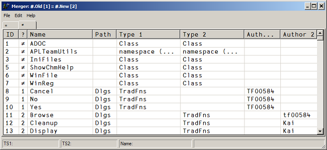
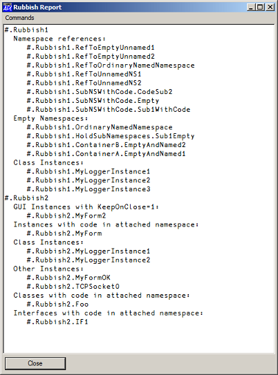

# Compare

## Overview

Compare offers a couple of methods designed to compare functions, operators, scripts and files. It is also able to deal with SALTed files as well as acre component files. 

Since version 3.0 Compare inherits from the then created class `CompareSimple`. It therefore offers the same methods as `CompareSimple`. 

Additionally it offers a "Merge" feature which allows one to compare &mdash; and merge &mdash; two namespaces in the same workspaces or even the contents of two workspaces.

## Methods

There are three main functions:

### The function `Match` (inherited from `CompareSimple`)

`Match` takes names of functions or operators or scripts and compares the source code. Note that taking the source code with `⎕CR` or `⎕SRC` and then ≡ them is not always going to work: white spaces as well as formatting problems might result in a 0 when the source code is in fact identical. Match deals with these problems properly.

### The function `These` (inherited from `CompareSimple`)

`These` accepts a variety of arguments listed underneath. From the arguments provided it tries to figure out what your intention is and carries out the appropriate action.

#### Script / Script

Compare the two scripts. Note that you can specify name(s) as well as reference(s).

#### Script / name of a \*.dyalog file

Compare the workspace script with the file.

#### Script

This syntax requires "Script" to be a SALTed script. In that case the workspace script is compared with its SALTed source file.

#### Name of a native file / name of a native file

Compare the two files.

#### Function name / function name

Compare two functions in the workspace.

#### Function name / name of a native file

Compare the function in the workspace with the file.

#### Function name / name of an `acre` component file

Compare the function in the workspace with the acre component file.

#### Function name

If there is an acre component file holding that function the workspace version is compared with any of the components. 

#### Namespace / namespace

Use method Merge for this.

#### The function `Merge`

Although this method works "only" on (named!) namespaces one can effectively use it to compare and merge workspaces by copying the two workspaces into two separate namespaces.

The `Merge` method presents a GUI with all the information one needs to know in order to perform the merge. Note that all functions, operators and scripts that do equal are on the "=" tab while all the others are on the "≠" tab. Usually one is interested in the "≠" tab only:

There are methods available that makes it easy to compare, modify, delete (either from the GUI or the workspace) and move functions, operators and scripts from one namespace to the other:

With version 3.2 a "Rubbish report" was added. This report lists all sort of stuff that is by many considered to be something that should not be saved with a workspace. This is just an example: 

